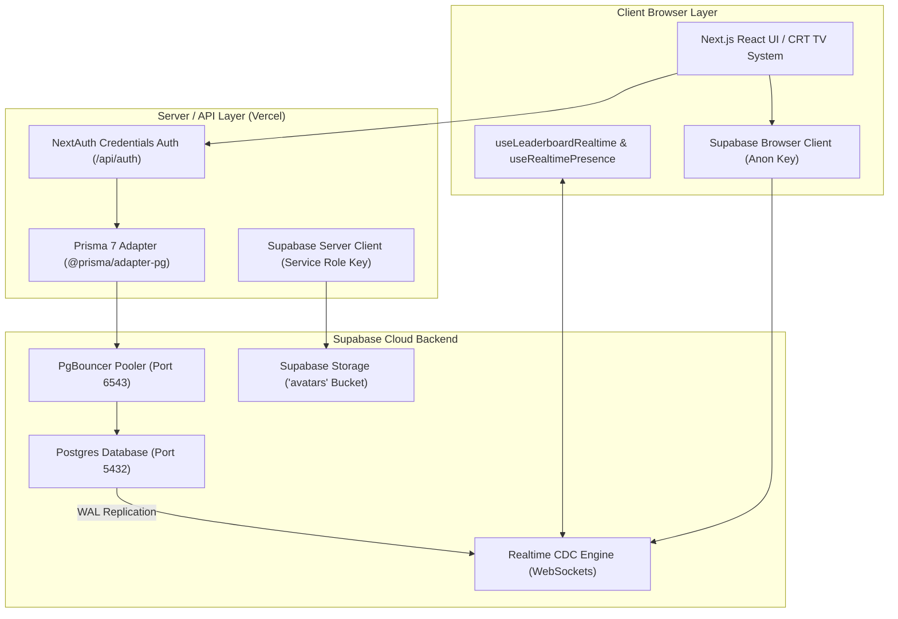

# TypeMaster Web — System Architecture Document (v3.0.0 Supabase)

## High-Level Architecture Diagram

---

## Component Definitions
1. **Database Tier**: Supabase PostgreSQL with PgBouncer connection pooler on port 6543 (`DATABASE_URL`) and direct port 5432 (`DIRECT_URL`).
2. **Storage Tier**: Supabase Storage public `avatars` bucket for user profile avatar uploads.
3. **Realtime Event Tier**: Supabase Change Data Capture (CDC) streaming postgres changes over WebSockets to client applications.
4. **ORM Tier**: Prisma 7 configured dynamically with `@prisma/adapter-pg` and `pg.Pool` driver adapter in `src/lib/db.ts`.

---

## Key Data & Realtime Event Flows

### 1. Typing Session Submission & Live Broadcast Flow
1. User completes typing test on `/play`.
2. Browser sends `POST /api/sessions` payload to Next.js API server.
3. API route validates payload and persists `Session` row via `db.session.create()`.
4. PostgreSQL writes row to Write-Ahead Log (WAL).
5. Supabase CDC engine detects WAL event on `Session` table and publishes JSON payload to publication `supabase_realtime`.
6. Client hook `useLeaderboardRealtime` receives WebSocket message, debounces 300ms, and updates Leaderboard UI with CRT row flash highlight.

